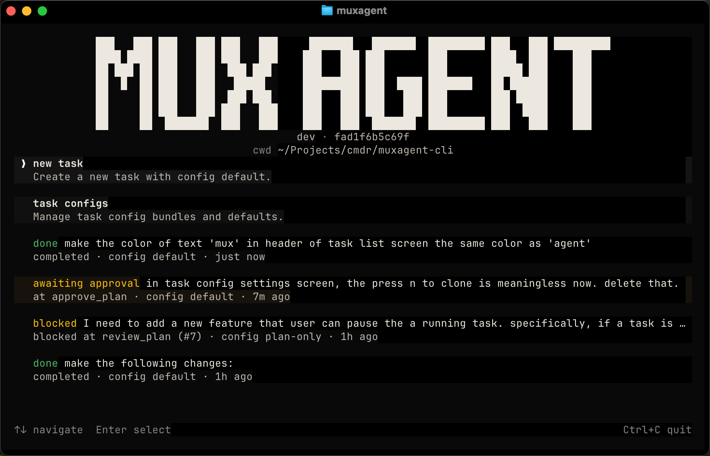
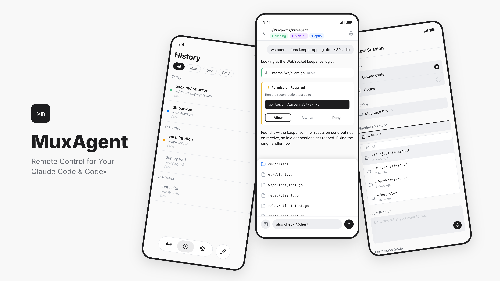

# MuxAgent CLI



MuxAgent is a task-first TUI for AI coding agents. Define workflow graphs —
plan, review, approve, implement, verify — and run them with Codex or Claude
Code.

## What MuxAgent Does

- **Task System** — Define multi-step workflow graphs that AI coding agents
  execute. Three built-in configs for different risk tolerances. Supports
  Codex and Claude Code runtimes.
- **Remote Control** — Monitor and control Claude Code sessions from your
  phone via a paired mobile app.

## Installation

### macOS / Linux

```bash
curl -fsSL https://raw.githubusercontent.com/LaLanMo/muxagent-cli/main/install.sh | sh
```

The install script puts `muxagent` in `/usr/local/bin` when writable, otherwise
it falls back to `~/.local/bin`.

### Windows

Download the latest `muxagent-windows-*.zip` bundle from
[GitHub Releases](https://github.com/LaLanMo/muxagent-cli/releases), unzip it,
and run `muxagent.exe`.

Official installs include everything needed to run MuxAgent with Claude Code.

## Quick Start

### Task System

```bash
muxagent
```

This opens the task-first TUI. Pick a task config (`default`, `autonomous`, or
`plan-only`), describe your task, and the workflow handles the rest.

### Remote Control



1. Download the MuxAgent mobile app.
   [Google Play](https://play.google.com/store/apps/details?id=ai.soloflux.muxagent) | iOS coming soon.
2. Run:

   ```bash
   muxagent daemon start
   ```

3. Scan the QR code in the app to finish setup.

On a new machine, `muxagent daemon start` begins first-time setup, shows a QR
code, waits for approval in the mobile app, and then starts the daemon.

You can also run `muxagent auth login` manually if you want to pair before
starting the daemon.

## Built-in Workflows

A task config defines a workflow graph — the sequence of nodes and the edges
between them that an AI agent follows. MuxAgent ships four built-in configs:

**`default`** — When you want human sign-off before code changes land.

```
        ┌─────────────────────────┐
        │  (approval rejected)    │
        ▼                         │
       plan ──▶ review ──▶ approve ──▶ implement ──▶ verify ──▶ done
        ▲         │                      ▲              │
        └─────────┘                      └──────────────┘
     (review rejected)                    (verify failed)
```

**`autonomous`** — When you trust the agent and want fast iteration.

```
       plan ──▶ review ──▶ implement ──▶ verify ──▶ done
        ▲         │           ▲              │
        └─────────┘           └──────────────┘
     (review rejected)         (verify failed)
```

**`plan-only`** — When you want a reviewed plan without touching code.

```
       plan ──▶ review ──▶ done
        ▲         │
        └─────────┘
     (review rejected)
```

**`yolo`** — Fully autonomous multi-wave mode. No approval, no clarification.

```
       ┌──────────────────────────────────────────────────┐
       │                                    (next wave)   │
       ▼                                                  │
      plan ──▶ review ──▶ implement ──▶ verify ──▶ evaluate ──▶ done
       ▲         │           ▲              │
       └─────────┘           └──────────────┘
    (review rejected)         (verify failed)
```

Built-in configs are different from runtime selection:

- a built-in config chooses the workflow graph, bundled prompts, and product intent
- runtime selection chooses which coding runtime executes agent nodes, for example `codex` or `claude-code`

## Customizing Workflows

Built-in configs are stored as task config bundles under `~/.muxagent/taskconfigs`.
You can clone them and modify the YAML to change the workflow graph, prompts,
runtime, iteration limits, or clarification settings.

If you already have a user config named `plan-only`, `autonomous`, or `yolo`, MuxAgent
preserves it and installs the built-in config under a fallback alias such as
`builtin-plan-only`. Existing bundle files are never overwritten.

See [Task Config Semantics](docs/task-config-semantics.md) for the full edge,
iteration, and schema specification.

## Commands

**Task TUI**

- `muxagent` — Launch the task-first TUI.

**Daemon**

- `muxagent daemon start` — Start first-time setup or start the daemon.
- `muxagent daemon status` — Show daemon status.
- `muxagent daemon stop` — Stop the daemon.

**Auth**

- `muxagent auth status` — Show pairing status.

**General**

- `muxagent version` — Show the installed CLI version.
- `muxagent update` — Update `muxagent`.
